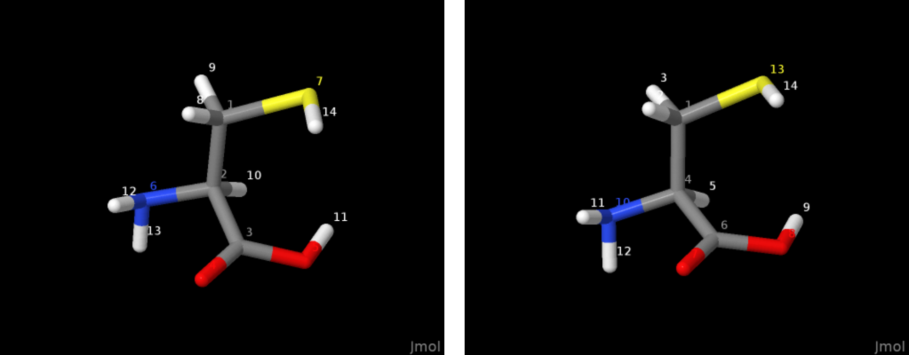

# documentation

## motivation

Crystallographic models of small molecule compounds tend to report
hydrogens just after the non-hydrogen atoms the former bind to. For one,
this reflects a typical sequence of structure solution, where the
identification of heavier (i.e. stronger scattering) atoms in the
Fourier maps often is easier (and hence earlier completed), than of the
lighter atoms. In addition, the initial position of hydrogens is based
on templates in reference to the non-H atom (e.g., `HFIX` commands in
ShelX[^1]) prior to structure refinement where (among other adjustments)
atom coordinates are moved. Aside from crystallography, this
organization was described as potentially useful in the course of
analyzing NMR spectra.[^2]

Departing from a SMILES string, OpenBabel[^3] can propose a 3D model,
for instance a .xyz file where hydrogen atoms complete valences.
Contrasting to a crystallographic model, atoms like C, N, O, P, S
however appear ahead of the hydrogen they bind to:

``` shell
$ obabel -:"c1ccncc1" -h --gen3d -O pyridine.xyz
$ cat pyridine.xyz
11

C          1.43303        0.05159        0.00100
C          0.68800        1.22595        0.00151
C         -0.69424        1.12564        0.00218
N         -1.36237       -0.04853        0.00552
C         -0.61197       -1.17189        0.00692
C          0.77379       -1.17331        0.00332
H          2.51852        0.09036       -0.00113
H          1.17153        2.19630        0.00127
H         -1.31976        2.01344        0.00006
H         -1.17257       -2.10232        0.01145
H          1.32543       -2.10632        0.00270
```

Note the sequence of atoms; nitrogen, fourth in sequence of the input
atoms, equally is the forth non-hydrogen atom in the output.

The purpose of this Fortran program is to rearrange the atom sequence in
.xyz files to be "crystallography like". This is even more appealing
OpenBabel retains this (new) sequence in a subsequent conversion of the
.xyz file to MDL's `.mol` and `.sdf` format, or Tripos' `.mol2`.

The result of the script's operation can be visualized with the example
of cysteine:

<figure width="800px">

<figcaption>Model of cysteine prior (left) and after (right hand side)
application of the Fortran code.</figcaption>
</figure>

## suggested use

The implementation is one Fortran file. The executable (here abbreviated
as `exe`) can be compiled by gfortran,[^4] for example in Linux
Debian 13 by

``` shell
gfortran resort_hydrogens.f90 -o exe
```

The edited sequence of the atoms in an xyz file (provided for instance
by OpenBabel) can be accessed from the CLI by a subsequent call in line
of

``` shell
$ ./exe pyridine.xyz
11

C         1.43303        0.05159        0.00100
H         2.51852        0.09036       -0.00113
C         0.68800        1.22595        0.00151
H         1.17153        2.19630        0.00127
C        -0.69424        1.12564        0.00218
H        -1.31976        2.01344        0.00006
N        -1.36237       -0.04853        0.00552
C        -0.61197       -1.17189        0.00692
H        -1.17257       -2.10232        0.01145
C         0.77379       -1.17331        0.00332
H         1.32543       -2.10632        0.00270
```

From there, a redirect into a permanent record (`>`) is possible. Note
the maximal length of the input file name is 200 characters. If used, up
to 200 characters of the title line will be preserved, too.

The executable provides an optional parameter `-s` to automatically
write a permanent record:

``` shell
$ ./exe pyridine.xyz -s
$ cat pyridine.xyz_resort.xyz
11

C         1.43303        0.05159        0.00100
H         2.51852        0.09036       -0.00113
C         0.68800        1.22595        0.00151
H         1.17153        2.19630        0.00127
C        -0.69424        1.12564        0.00218
H        -1.31976        2.01344        0.00006
N        -1.36237       -0.04853        0.00552
C        -0.61197       -1.17189        0.00692
H        -1.17257       -2.10232        0.01145
C         0.77379       -1.17331        0.00332
H         1.32543       -2.10632        0.00270
```

On a shell like Gnu Bash,[^5] it equally is possible to use the
executable inside a do-loop, or with GNU Parallel:[^6]

``` bash
ls *.xyz | while read i; do exe "$i" -s; done  # sequential run
ls *.xyz | parallel -j4 "exe {} -s"  # use up to 4 processors
```

A direct pipe like

``` bash
$ obabel -:"c1ccncc1" -h --gen3d -oxyz | ./exe | obabel -ixyz -O out.mol2
1 molecule converted
1 molecule converted
$ cat out.mol2
@<TRIPOS>MOLECULE
*****
 11 11 0 0 0
SMALL
GASTEIGER

@<TRIPOS>ATOM
      1 C           1.4330    0.0516    0.0010 C.ar    1  UNL1       -0.0589
      2 H           2.5185    0.0904   -0.0011 H       1  UNL1        0.0618
      3 C           0.6880    1.2260    0.0015 C.ar    1  UNL1       -0.0436
      4 H           1.1715    2.1963    0.0013 H       1  UNL1        0.0633
      5 C          -0.6942    1.1256    0.0022 C.ar    1  UNL1        0.0276
      6 H          -1.3198    2.0134    0.0001 H       1  UNL1        0.0829
      7 N          -1.3624   -0.0485    0.0055 N.ar    1  UNL1       -0.2633
      8 C          -0.6120   -1.1719    0.0069 C.ar    1  UNL1        0.0276
      9 H          -1.1726   -2.1023    0.0115 H       1  UNL1        0.0829
     10 C           0.7738   -1.1733    0.0033 C.ar    1  UNL1       -0.0436
     11 H           1.3254   -2.1063    0.0027 H       1  UNL1        0.0633
@<TRIPOS>BOND
     1     2     1    1
     2     6     5    1
     3     1     3   ar
     4     1    10   ar
     5     4     3    1
     6     3     5   ar
     7     5     7   ar
     8    11    10    1
     9    10     8   ar
    10     7     8   ar
    11     8     9    1
```

equally is possible.

Folder `examples` include reference data about diethyl ether, pyridine,
and cysteine prior and after running the executable.

An optional conversion of the newly written `.xyz` file into the `.mol`
file format (and others) is beyond the scope of this project.
Applications like Avogadro2,[^7] OpenBabel,[^8] or RDKit[^9] to mention
a few provide this functionality.

## details of implementation, known limitations

The .xyz file is void of information about bond order and connectivity
tables found in a .sdf file. Nevertheless, the implementation presumes a
distance of 1.7 Angstrom or less *alone* to be a sufficient criterion to
attribute a hydrogen to a non-hydrogen atom. Hence, atoms read from the
input file are classified to belong to either set of hydrogens, or
non-hydrogens.

The arbitrary threshold seems to be suitable for a wide range of
covalent bonds with hydrogen atoms: IUCr reports C-H single bonds of
alkanes with about 1.1 Angstrom,[^10] while Wikipedia mentions 160.9 pm
(about 1.6 A) for the H-I bond in hydrogen iodide.[^11]

On the other hand, the i) current classification of atoms in either
hydrogen or non-hydrogen atoms and ii) subsequent check of one atom of
one set with an atom of the other set is not suitable for structures
with H-H bonds as in molecular hydrogen. A future revision of this
implementation might close this gap.

The upper limit of atoms per xyz file the executable can process is
2147483647 (i.e., about 2.1E9).

## License

Norwid Behrnd, 2024 GPL v2

## Footnotes

[^1]: Sheldrick, G. M. Crystal Structure Refinement with SHELXL. *Acta
    Cryst. C* **2015**, *71* (1), 3–8.
    <https://doi.org/10.1107/S2053229614024218>.

[^2]: <https://github.com/openbabel/openbabel/issues/2733>

[^3]: <https://github.com/openbabel/openbabel>

[^4]: for guidelines, see <https://gcc.gnu.org/fortran/> and
    <https://fortran-lang.org/learn/os_setup/install_gfortran>

[^5]: Tortoise Git adds this functionality to the Windows operating
    system, too. For details, see <https://tortoisegit.org/>.

[^6]: <https://www.gnu.org/software/parallel>

[^7]: see <https://two.avogadro.cc> and
    <https://github.com/OpenChemistry/avogadroapp>

[^8]: <https://github.com/openbabel/openbabel>

[^9]: <https://github.com/rdkit/rdkit>

[^10]: Allen, F. H.; Watson, D. G.; Brammer, L.; Orpen, A. G.; Taylor,
    R. Typical Interatomic Distances: Organic Compounds. In
    *International Tables for Crystallography*; Prince, E., Ed.; Fuess,
    H., Hahn, Th., Wondratschek, H., Müller, U., Shmueli, U., Prince,
    E., Authier, A., Kopský, V., Litvin, D. B., Rossmann, M. G., Arnold,
    E., Hall, S., McMahon, B., Series Eds.; International Union of
    Crystallography: Chester, England, 2006; Vol. C, pp 790–811.
    <https://doi.org/10.1107/97809553602060000621> or
    <https://onlinelibrary.wiley.com/iucr/itc/Cb/ch9o5v0001/table9o5o1o1>
    For the purpose of this documentation, much of the precision and
    additional detail this reference provides about C(sp3)-H bonds in
    particular, and typical bond lengths in general was removed.

[^11]: <https://en.wikipedia.org/wiki/Hydrogen_iodide>
